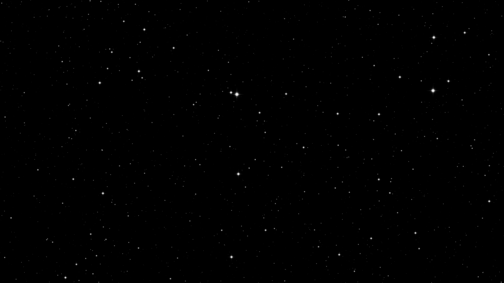

# AllTheStars

AllTheStars is a high-performance starfield simulation and rendering demo built with C++ and [SFML 3](https://www.sfml-dev.org/). It features thousands of stars rendered in real-time with smooth animation and depth effects.

## Features

- Renders 10,000+ stars with perspective and depth shading
- Uses a textured sprite for each star
- Continuous starfield motion (stars move toward the viewer)
- Fullscreen mode by default
- High framerate (configurable)
- Simple, modern CMake build system (FetchContent for SFML)

## Screenshots



## Getting Started

### Prerequisites

- C++17 compatible compiler
- [CMake 3.28+](https://cmake.org/)
- Git

### Building

1. Clone the repository:
   ```sh
   git clone <this-repo-url>
   cd AllTheStars
   ```
2. Configure and build:
   ```sh
   cmake -B build
   cmake --build build
   ```
3. Run the executable:
   ```sh
   build/bin/AllTheStars.exe
   ```

### Controls

- `Esc` or `Q`: Quit the application

## Project Structure

- `src/` — Main source code (C++)
- `res/` — Resources (star texture)
- `CMakeLists.txt` — Build configuration

## Configuration

You can adjust simulation parameters in `src/config.hpp`:

- `count` — Number of stars
- `radius` — Star size
- `far`, `near` — Depth range
- `speed` — Starfield speed
- `MAX_FRAMERATE` — Framerate cap

## Dependencies

- [SFML 3](https://github.com/SFML/SFML) (fetched automatically by CMake)

## License

This project is licensed under Public Domain. See `LICENSE.md` for details.
